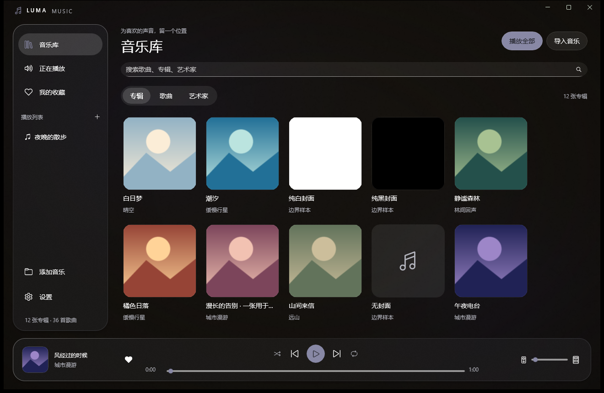
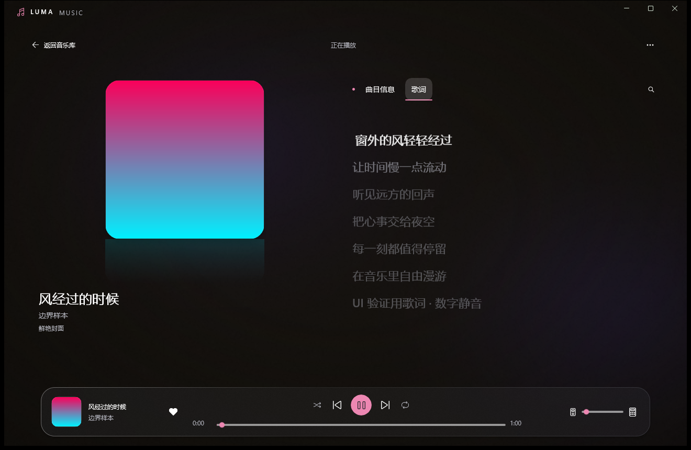
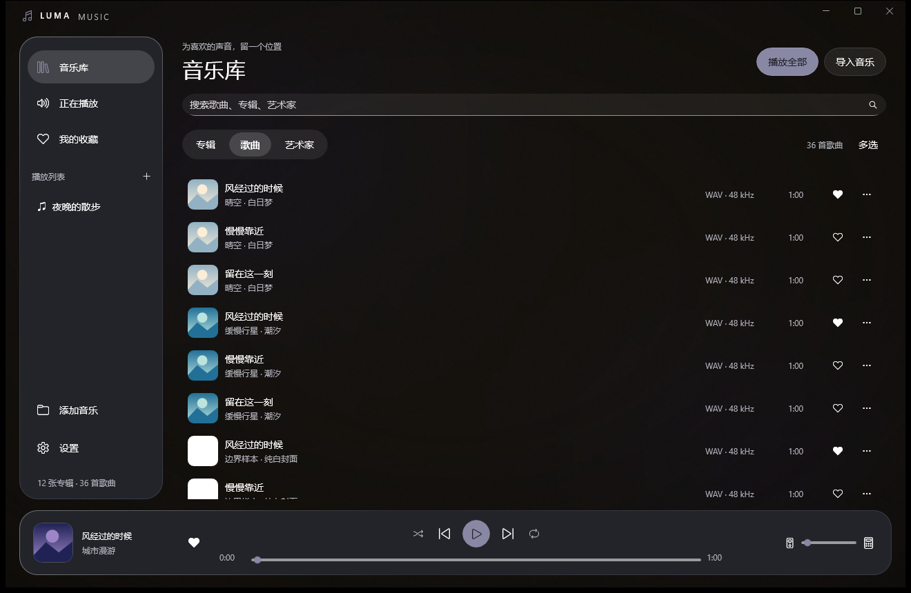
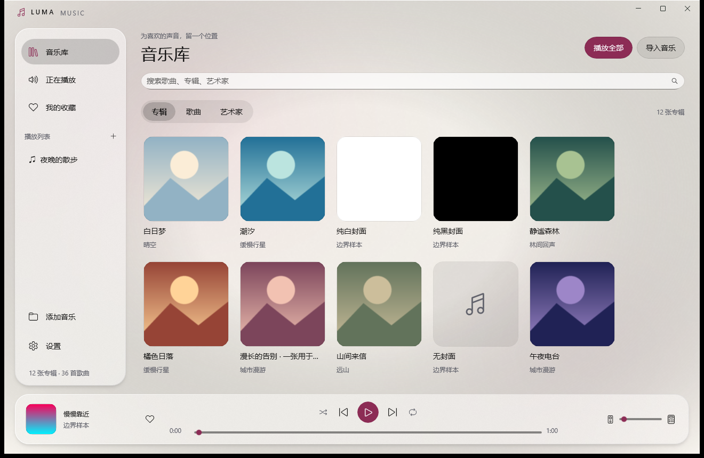
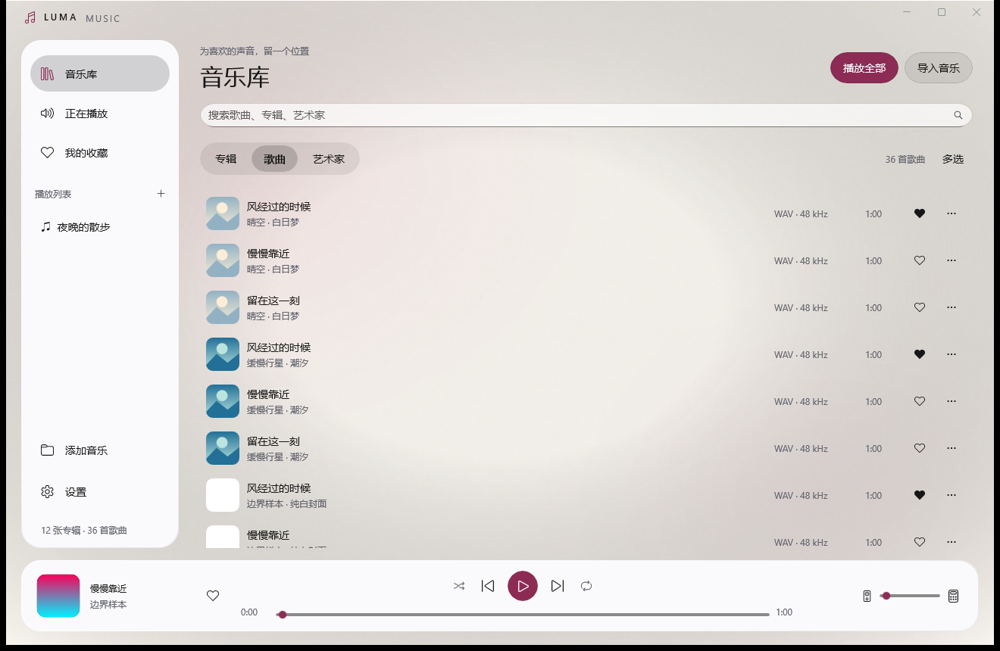
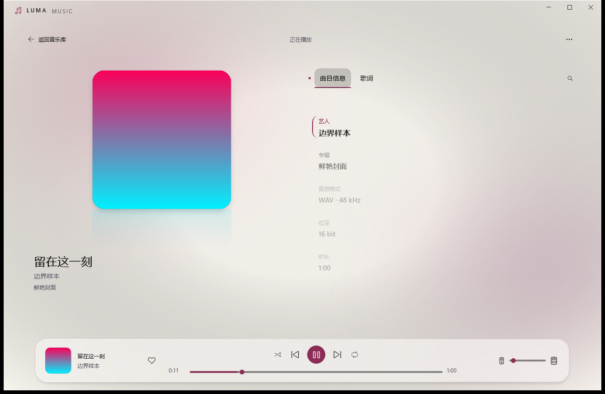

# LumaMusic

Windows 无损音乐播放器：WinUI 3 前端 + C++/BASS 原生音频引擎，面向位完美（bit-perfect）回放。

## 界面预览

| 音乐库（深色） | 正在播放（深色） |
| --- | --- |
|  |  |

| 歌曲列表（深色） | 音乐库（浅色） |
| --- | --- |
|  |  |

| 歌曲列表（浅色） | 正在播放（浅色） |
| --- | --- |
|  | 

## 特性

- **格式**：FLAC / APE / ALAC / Opus / WavPack / WAV，以及 **DSF / DFF / SACD ISO**（内置 DSD 解码工作进程，支持 DST 解码）
- **DSD 回放**：DSD 转 PCM、DoP 透传、ASIO 原生 DSD（Native DSD）
- **输出后端**：WASAPI 共享 / WASAPI 独占 / ASIO，采样率可跟随音源或强制指定；系统没有 ASIO 驱动时可在设置里**一键安装随应用附带的 FlexASIO 通用驱动**（自动配置为 WASAPI 独占），开箱即得 ASIO 独占输出
- **按设备记忆配置**：每台输出设备独立保存输出方式、DSD 模式、通道映射等档案
- **ASIO 通道映射**：多声道输出可自定义 ASIO 通道顺序
- **歌词与封面**：联网搜索歌词/专辑封面、本地 LRC 导入、逐行动画歌词
- **沉浸播放**：全屏播放页含封面磨砂倒影与分组入场动效，曲目信息 / 歌词平滑切换；按封面取色生成**三色动态环境光**，随播放、暂停、切曲漂移呼吸，暂停时平滑渐暗
- **媒体库**：文件夹导入、播放列表、收藏、播放队列、上次播放记忆
- **界面**：悬浮玻璃导航与播放条、封面背景边缘透镜、专辑优先浏览、页面内艺术家浏览、浅深主题和紧凑布局；支持减少动态与透明效果

## 系统要求

- Windows 10 2004（build 19041）或更高，x64
- 无需安装 .NET 运行时与 Windows App SDK（自包含发布）

## 从源码构建

需要 Python 3（仅用于依赖引导）与 Visual Studio 2022（含 CMake、MSVC v143）。

```powershell
python scripts/bootstrap.py        # 下载 pinned 依赖（BASS SDK、SACD 解码源码、.NET SDK）到本地
powershell scripts/build-native.ps1  # 构建 C++ 原生引擎（LumaAudio.dll / LumaDsd.exe）并跑原生测试
powershell scripts/build.ps1         # 构建 WinUI 3 应用
powershell scripts/run-dev.ps1       # 以独立测试档案启动开发版
```

所有第三方依赖均为构建时按 pinned 地址下载，不随仓库分发。

## UI 回归

构建依赖与原生引擎就绪后，执行 `powershell scripts/test-ui.ps1`（Python 需要 Pillow；可用 `-Python` 指定解释器）。脚本创建 `build/ui-regression-时间戳` 隔离档案，使用生成的封面与数字静音，验证主题、三种窗口尺寸、浏览筛选、快速换封面、材质降级与真实回放，结果写入档案内的 `ui-regression.json`。回归入口仅在 `-p:LumaUiRegression=true` 时编译，普通构建和发布不包含该入口。

材质实现使用应用内 Acrylic 与共享背景的局部放大边缘，属于轻量透镜近似，不对任意滚动内容进行物理折射。系统关闭特效、省电或图形能力不足时使用静态材质。详细交付与验证记录见 [UI 改版验证说明](docs/liquid-glass-validation.md)。

## 架构

```
app/     WinUI 3（C#，net10.0-windows10.0.19041.0，x64）
native/  C++ 音频引擎
         ├ LumaAudio.dll  播放引擎（C 导出 API：设备枚举 / 打开 / 状态 / 音量）
         └ LumaDsd.exe    DSD 解码工作进程（DSF/DFF/ISO → DSD 或 PCM 流）
```

前端通过 P/Invoke 调用 `LumaAudio.dll`；引擎内部基于 BASS / BASSWASAPI / BASSASIO / BASSMIX，DSD 解码复用 [Kodi audiodecoder.sacd](https://github.com/xbmc/audiodecoder.sacd)（Piers 分支）。

## 说明

- 本项目为个人项目，仅供学习交流；BASS 库版权归 [un4seen](https://www.un4seen.com/) 所有，由构建脚本从官方下载，本仓库不包含其任何文件。第三方组件详见 [THIRD-PARTY-NOTICES.md](THIRD-PARTY-NOTICES.md)。
- ASIO 输出开箱即用：系统没有任何 ASIO 驱动时，在「播放设置」选择 ASIO 输出方式，点击"一键安装 FlexASIO 通用驱动"（需一次管理员确认），安装后自动以 WASAPI 独占方式输出。若 DAC 有厂商 ASIO 驱动（支持原生 DSD），优先使用厂商驱动。
- DoP 透传需要 24 位输出路径：本应用在 FlexASIO 上会自动强制 24 位容器；ASIO4ALL 若与设备协商成 16 位会截断 DoP 产生噪声，此类情况请改用厂商 ASIO 或 FlexASIO。
